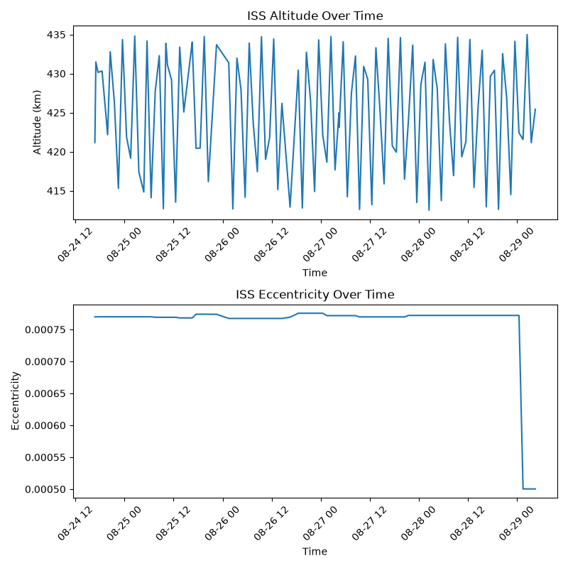

# Satellite Orbit Analysis & Prediction

An interactive Python application for real time satellite orbital analysis and position forecasting, built on live Two-Line Element (TLE) data, SGP4 orbital propagation, and statistical linear regression modelling with a focus on the International Space Station (ISS), although code can be modified to track any other satellite with a NORAD catalog number.

The project collects real ISS tracking data, compares it against classical orbital mechanics (Kepler's third law), detects genuine orbital manoeuvres directly from public tracking data, and compares a physics based prediction model against a data driven statistical model all presented through an interactive Streamlit dashboard with errors included.

## Live App

```
pip install -r requirements.txt
python -m streamlit run app.py
```

This opens the dashboard in your browser, showing:
- Dataset overview (data points collected, time span, latest reading)
- Model accuracy (MAE / RMSE, evaluated on your dataset)
- Observed vs theoretical (Keplerian) orbital period comparison
- Altitude and eccentricity visualised over time
- Future altittude prediction: physics based (SGP4) vs data driven (linear regression)

## What it does

- Pulls live TLE orbital data for the ISS from Celestrak and calculates position using the SGP4 propagation model through Skyfield
- Measures altitude as true distance from Earth's centre rather than height above the ground directly below the satellite. The latter is noisy because Earth isn't a perfect sphere, so that measurement drifts depending on which part of the globe the satellite is over, even when its real orbital altitude hasn't changed.
- Can log orbital data automatically on an hourly schedule using Windows Task Scheduler, building up a continuous historical dataset (timestamp, latitude, longitude, altitude, eccentricity)
- Compares the ISS's observed orbital period (worked out from the TLE's mean motion value) against the theoretical period predicted by Kepler's third law
- Picks up on step changes in orbital eccentricity that line up with real orbital adjustment manoeuvres
- Predicts future altitude two different ways, on purpose, so they can be compared:
  - Physics based: SGP4 orbital propagation, which already accounts for atmospheric drag through the TLE's BSTAR term
  - Data driven: linear regression fitted on a smoothed version of the historical altitude trend
- Tests the data driven model by training it only on earlier data and checking its predictions against later data it hasn't seen, then reports the average error (MAE) and a version of the error that penalises big misses more (RMSE)

## Key findings

**The observed orbital period closely matches what Kepler's third law predicts.** The ISS's real orbital period, worked out from the TLE's mean motion value, closely matches the theoretical period calculated independently using Kepler's third law. This confirms that classical orbital mechanics accurately describes the ISS's motion, even though it's a real object affected by drag rather than an idealised point mass which assumes no drag.

**A real ISS reboost was picked up directly from public tracking data, with a noticeable delay before it showed up.** Eccentricity tracked over several days showed a change from around 0.000769 down to 0.0005, a change roughly ten times larger than the smaller fluctuations seen previously in the dataset included. Checking this against public reporting confirmed an ISS reboost manoeuvre happened on August 27th, closely lining up with the change, but the change didn't actually show up in TLE data until roughly one to two days later. This shows the real delay between an orbital manoeuvre happening and it actually being reflected in publicly available tracking data, since tracking stations need to observe the adjusted orbit first before an updated TLE can be published. It's worth noting that whether eccentricity increases or decreases after a reboost depends on where in the orbit the burn happens (a burn at the lowest point tends to increase eccentricity, while a burn at the highest point, or natural drag between reboosts, tends to decrease it). This project didn't model the burn itself, so the observed decrease is best described as consistent with the reported manoeuvre rather than definitely caused by it.

**The physics based and data driven predictions don't agree with each other, and that disagreement is actually the more interesting result.** The SGP4 model already accounts for atmospheric drag decay, but it has no way of knowing when a reboost will happen, since that's a human decision, not something governed by physics. The data driven model, on the other hand, is just fitting a straight line to a short window of naturally oscillating data, so whatever trend it "learns" is sensitive to what the altitude happened to be doing during that specific window, including any reboost effects that happened to be in the training data. Rather than treating this disagreement as something to eliminate, this project treats it as a genuine finding, showing the different blind spots of each approach.

**Latitude and longitude were deliberately left out of the data driven model.** The ISS's ground track is periodic, cycling through roughly the same latitude range about once every, approximately, 90 minute orbit, which breaks the basic assumption behind a straight line trend model. Rather than force an unsuitable method onto data that doesn't fit it, position prediction is handled entirely by the physics based model, which naturally accounts for the orbit's periodic nature, while the data driven model is only used for altitude, where a trend based approach actually makes sense.

**Model evaluation.** Using a chronological 80/20 split (training on the earlier 80% of the data and testing on the later 20%, rather than a random split, so the model is never accidentally trained on data from the future) the data driven altitude model achieved a mean absolute error of around 1.22 km and RMSE of around 1.53 km on data it hadn't seen before. That's a fairly small error given the ISS's altitude naturally swings by around plus or minus 10 km within a single orbit.

## Visualisations



## Project structure

```
satellite-tracker/

config.py            shared constants: filenames, TLE source URL, physical constants (Earth's gravitational parameter, Earth's radius)
getISS.py             fetches live TLE data, calculates position, logs it to CSV
orbitalAnalysis.py    compares observed orbital period against the theoretical Keplerian prediction
visualisation.py       standalone altitude and eccentricity plotting
predictPhysics.py     predicts future position using SGP4 orbital propagation
predictData.py        predicts future altitude using linear regression on historical data
evaluateModel.py      evaluates the data driven model using MAE and RMSE
app.py                 Streamlit dashboard 
iss_data.csv           accumulated historical dataset
requirements.txt
```

## Data source(s)

Orbital data (TLEs) comes from Celestrak. Celestrak's orbital data only updates two to three times a day and blocks IPs that send too many requests, which occurred in testing. If builiding your own dataset, I would recomend to record the data in 30 minute intervals at most via task scheduler as previously mentioned.

## Technical highlights

- Uses SGP4 orbital propagation through Skyfield, including its atmospheric drag handling
- Fixed a real measurement issue where altitude was being calculated relative to the ground below the satellite instead of Earth's centre, which was introducing noise unrelated to the satellite's actual motion
- Built an automated, scheduled data collection pipeline 
- Converted timestamps into a numeric time scale and smoothed the data with a rolling average, so a simple regression model could be applied to naturally oscillating orbital data
- Used a chronological train/test split rather than a random one, so the model is never evaluated on data that would have let it "see the future"
- Checked a pattern found in the data (the eccentricity change) against an independently reported real world event, rather than assuming it was significant just because it looked different
- Refactored standalone scripts into reusable functions so the same logic could be shared between the command line scripts and the Streamlit app, rather than duplicating code

